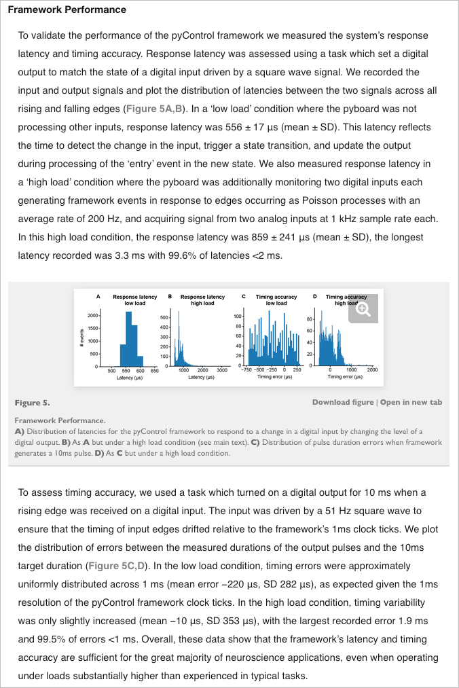
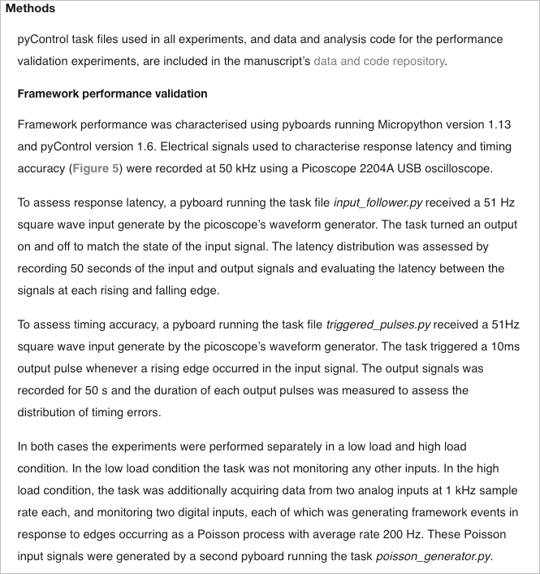

This folder contains the files needed to to analyze the peformance of the [pyControl D-series Breakout](https://karpova-lab.github.io/pyControl-D-Series-Breakout/) in comparison to the official [pyControl Breakout 1.2](https://pycontrol.readthedocs.io/en/latest/user-guide/hardware/#breakout-board-12). 

Data was collected from both pyboards ([v1.1](https://store.micropython.org/product/PYBv1.1#_) and [D-Series SF6W](https://store.micropython.org/product/PYBD-SF6-W4F2)) using an [Analog Discovery 2](https://reference.digilentinc.com/reference/instrumentation/analog-discovery-2/start).

To repeat the analysis use the [timing_analysis_ipynb](https://github.com/Karpova-Lab/pyControl-D-Series-Breakout/blob/master/benchmarking/timing_analysis.ipynb). The .npy data files can be downloaded from Dropbox [here](https://www.dropbox.com/sh/ct0zpvxmnmsktt1/AABsgd3lGLtRtKHfQOnN4Qg-a?dl=0).

The comparison was made by repeating the same methods found in [pyControl: Open source, Python based, hardware and software for controlling behavioural neuroscience experiments](https://www.biorxiv.org/content/10.1101/2021.02.22.432227v1). The below are excerpts from the manuscript describing the methods for assesing the pyControl performance on the pyboard microcontroller.

