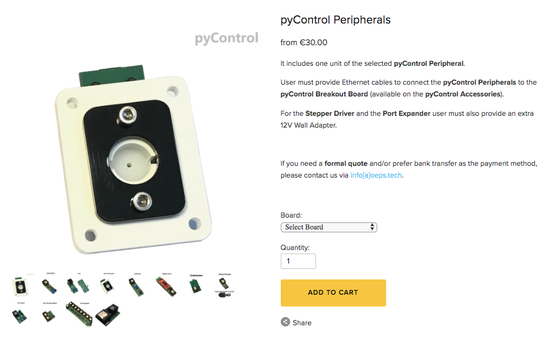

:github_url: https://github.com/Karpova-Lab/pyControl-D-series-Breakout

-----------------
Further Resources
-----------------

pyControl 
+++++++++

- `Official pyControl documentation <https://pycontrol.readthedocs.io/en/latest/>`_ 
- `pyControl Google groups forum <https://groups.google.com/forum/#!forum/pycontrol>`_ 
- `pyControl software repository <https://github.com/pyControl/pyControl>`_ [`Download Page <https://github.com/pyControl/pyControl/releases>`_]
- `pyControl hardware repository <https://github.com/ThomasAkam/pyControl_hardware>`_ 
- Purchase ready to use pyControl hardware at the `Open Ephys Store <http://www.open-ephys.org/pycontrol>`_ 

MicroPython and Pyboard D-series
++++++++++++++++++++++++++++++++

- `MicroPython Documentation <http://docs.micropython.org/en/latest/>`_ 
- `MicroPython Store <https://store.micropython.org/>`_ 
- `Pyboard D-series Documentation <https://pybd.io/hw/pybd_sfxw.html>`_ 

.. image:: images/dseries.jpg
    :width: 250px

pyControl D-series Breakout
+++++++++++++++++++++++++++
- `GitHub repository <https://github.com/Karpova-Lab/pyControl-D-series-Breakout>`_

.. image:: images/board_top.jpg
    :width: 250px

