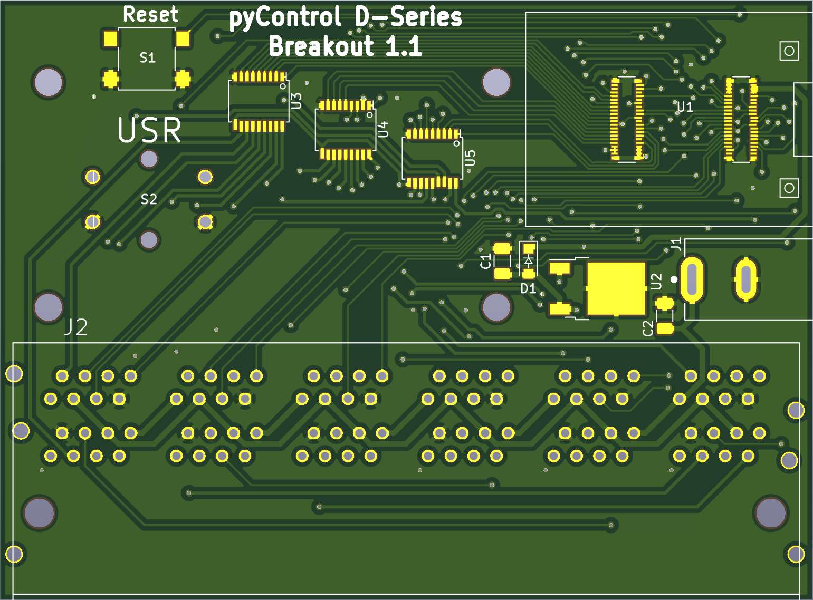
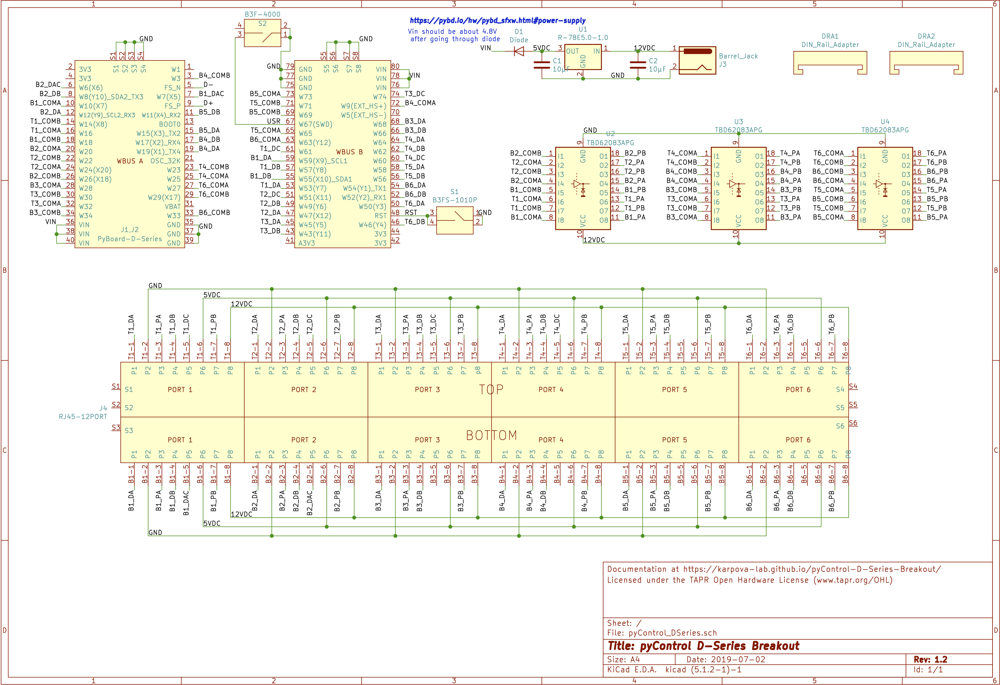
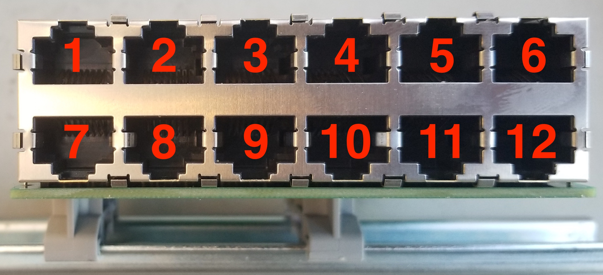
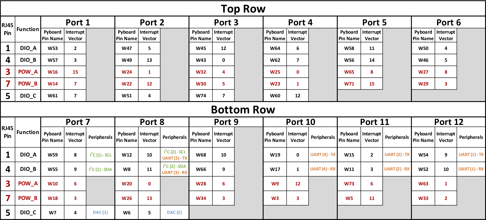

:github_url: https://github.com/Karpova-Lab/pyControl-D-series-Breakout

.. D-series Breakout documentation master file, created by
   sphinx-quickstart on Thu Apr 25 14:23:24 2019.
   You can adapt this file completely to your liking, but it should at least
   contain the root `toctree` directive.

pyControl D-series Breakout
===========================

.. figure:: images/board_iso.jpg
    :align: center
    
    pyControl D-series Breakout clipped onto `DIN rail <https://en.wikipedia.org/wiki/DIN_rail>`_ 

.. figure:: images/board_top.jpg
    :align: center

    Top view

What is this?
-------------

pyControl D-series breakout is a PCB that connects a  `pyboard D-series microcontoller <https://pybd.io/hw/pybd_sfxw.html>`_  with twelve RJ45 ports. 
It is intended to work with the `pyControl <https://pycontrol.readthedocs.io/en/latest/>`_ behavior control framework by using a microcontroller running `Micropython <https://micropython.org/>`_  and having the RJ45 connections that are pin compatible with `pyControl Devices <https://pycontrol.readthedocs.io/en/latest/user-guide/hardware/#breakout-boards>`_.

How is it different?
--------------------

The core distinction between this breakout board and the official `pyControl breakout board 1.2 <https://pycontrol.readthedocs.io/en/latest/user-guide/hardware/#breakout-board-12>`_  is the use of a newer generation pyboard. Aside from being smaller, faster, and having more memory, the major benefit of using the D-series pyboard is having access to more I/O pins. 
Having more pins enables the breakout to provide more behavior ports on a single smaller PCB without the need to add a `port expander <https://pycontrol.readthedocs.io/en/latest/user-guide/hardware/#port-expander>`_.

+---------------------+-------------------------------------------------------------------+--------------------------------------------------------------------------------+
|                     | Breakout Board 1.2                                                | D-series Breakout Board 1.4                                                    |
+=====================+===================================================================+================================================================================+
| **Microcontroller** |                                                                   |                                                                                |
+---------------------+-------------------------------------------------------------------+--------------------------------------------------------------------------------+
| - *Board*           | `pyboard v1.1 <https://store.micropython.org/product/PYBv1.1#_>`_ | `pyboard D-series SF6W <https://store.micropython.org/product/PYBD-SF6-W4F2>`_ |
+---------------------+-------------------------------------------------------------------+--------------------------------------------------------------------------------+
| - *CPU*             | 168 Mhz Cortex-M4F                                                | 216 MHz Cortex-M7F                                                             |
+---------------------+-------------------------------------------------------------------+--------------------------------------------------------------------------------+
| - *RAM*             | 192 KB                                                            | 512 KB                                                                         |
+---------------------+-------------------------------------------------------------------+--------------------------------------------------------------------------------+
| - *ROM*             | 512 KB                                                            | 4,048 KB                                                                       |
+---------------------+-------------------------------------------------------------------+--------------------------------------------------------------------------------+
| **Connectors**      |                                                                   |                                                                                |
+---------------------+-------------------------------------------------------------------+--------------------------------------------------------------------------------+
| - *RJ45*            | 6                                                                 | 12                                                                             |
+---------------------+-------------------------------------------------------------------+--------------------------------------------------------------------------------+
| - *BNC*             | 4                                                                 | 0                                                                              |
+---------------------+-------------------------------------------------------------------+--------------------------------------------------------------------------------+
| **Behavior Ports**  |                                                                   |                                                                                |
+---------------------+-------------------------------------------------------------------+--------------------------------------------------------------------------------+
| - *Power Pins*      | 14                                                                | 24                                                                             |
+---------------------+-------------------------------------------------------------------+--------------------------------------------------------------------------------+
| - *I/O Pins*        | 14                                                                | 30                                                                             |
+---------------------+-------------------------------------------------------------------+--------------------------------------------------------------------------------+
| - *UART*            | ports 3,4                                                         | ports 8,10,11,12                                                               |
+---------------------+-------------------------------------------------------------------+--------------------------------------------------------------------------------+
| - *DAC and I2C*     | ports 3,4                                                         | ports 7,8                                                                      |
+---------------------+-------------------------------------------------------------------+--------------------------------------------------------------------------------+
| **Interface**       |                                                                   |                                                                                |
+---------------------+-------------------------------------------------------------------+--------------------------------------------------------------------------------+
| - *Indicator LEDs*  | 10                                                                | 0                                                                              |
+---------------------+-------------------------------------------------------------------+--------------------------------------------------------------------------------+
| - *Pushbutton*      | 1                                                                 | 1                                                                              |
+---------------------+-------------------------------------------------------------------+--------------------------------------------------------------------------------+
| **Dimensions**      |                                                                   |                                                                                |
+---------------------+-------------------------------------------------------------------+--------------------------------------------------------------------------------+
| - *PCB Footprint*   | 1.8 in x 7.6 in                                                   | 2.7 in x 3.6 in                                                                |
+---------------------+-------------------------------------------------------------------+--------------------------------------------------------------------------------+

Bill of Materials
-----------------
:download:`Interactive BOM (right click and open in new tab) <pyControl_DSeries_1.4.html>` 

.. BOM start

+-----+-----------------------------+---------------------------------------------------------------------------------------------+---------------------------------------------------------------------------------------------------------------------------------------+
| Qty | Description                 | Datasheet                                                                                   | Order Link                                                                                                                            | 
+=====+=============================+=============================================================================================+=======================================================================================================================================+
| 1   | Printed Circuit Board       |  :download:`pyControl D-Series Breakout 1.4<../../manufacturing/datasheets/breakout.pdf>`   | `OSH Park <https://oshpark.com/shared_projects/qB3NMaHN>`__                                                                           | 
+-----+-----------------------------+---------------------------------------------------------------------------------------------+---------------------------------------------------------------------------------------------------------------------------------------+
| 2   | DIN Rail Adapter            |  :download:`1201578<../../manufacturing/datasheets/DIN_clip.pdf>`                           | `Digi-Key <https://www.digikey.com/products/en?keywords=277-2296-nd>`__                                                               | 
+-----+-----------------------------+---------------------------------------------------------------------------------------------+---------------------------------------------------------------------------------------------------------------------------------------+
| 1   | Large Button                |  :download:`TL3300DF160Q<../../manufacturing/datasheets/tactile_switch_large.pdf>`          | `Digi-Key <https://www.digikey.com/products/en?keywords=EG4906CT-ND>`__                                                               | 
+-----+-----------------------------+---------------------------------------------------------------------------------------------+---------------------------------------------------------------------------------------------------------------------------------------+
| 1   | Small Button                |  :download:`B3FS-1010P<../../manufacturing/datasheets/tactile_switch_small.pdf>`            | `Digi-Key <https://www.digikey.com/products/en?keywords=sw1440ct>`__                                                                  | 
+-----+-----------------------------+---------------------------------------------------------------------------------------------+---------------------------------------------------------------------------------------------------------------------------------------+
| 1   | Barrel Jack Connector       |  :download:`PJ-037A<../../manufacturing/datasheets/barrel_jack.pdf>`                        | `Digi-Key <https://www.digikey.com/products/en?keywords=CP-037A-ND>`__                                                                | 
+-----+-----------------------------+---------------------------------------------------------------------------------------------+---------------------------------------------------------------------------------------------------------------------------------------+
| 1   | 12-Port RJ45 Connector      |  :download:`5569263-1<../../manufacturing/datasheets/rj45_12port.pdf>`                      | `Digi-Key <https://www.digikey.com/products/en?keywords=5569263>`__                                                                   | 
+-----+-----------------------------+---------------------------------------------------------------------------------------------+---------------------------------------------------------------------------------------------------------------------------------------+
| 2   | 40-pin WBUS Connector       |  :download:`DF40HC(4.0)-40DS-0.4V(70)<../../manufacturing/datasheets/40_pin_connector.pdf>` | `Digi-Key <https://www.digikey.com/product-detail/en/DF40HC(4.0)-40DS-0.4V(70)/H124604CT-ND/5155907/?itemSeq=290724516>`__            | 
+-----+-----------------------------+---------------------------------------------------------------------------------------------+---------------------------------------------------------------------------------------------------------------------------------------+
| 1   | Micro USB horizontal socket |  :download:`10118194-0001LF<../../manufacturing/datasheets/horz_µUSB.pdf>`                  | `Digi-Key <https://www.digikey.com/products/en?keywords=609-4618-1-ND>`__                                                             | 
+-----+-----------------------------+---------------------------------------------------------------------------------------------+---------------------------------------------------------------------------------------------------------------------------------------+
| 1   | 5V DC to DC Converter       |  :download:`R-78E5.0-1.0<../../manufacturing/datasheets/dc_converter.pdf>`                  | `Digi-Key <https://www.digikey.com/products/en?keywords=945-2201-ND>`__                                                               | 
+-----+-----------------------------+---------------------------------------------------------------------------------------------+---------------------------------------------------------------------------------------------------------------------------------------+
| 3   | Transistor Array            |  :download:`TBD62083AFNG<../../manufacturing/datasheets/transistor_array.pdf>`              | `Digi-Key <https://www.digikey.com/product-detail/en/toshiba-semiconductor-and-storage/TBD62083AFNGEL/TBD62083AFNGELCT-ND/5514123>`__ | 
+-----+-----------------------------+---------------------------------------------------------------------------------------------+---------------------------------------------------------------------------------------------------------------------------------------+
| 1   | Diode                       |  :download:`MBR120VLSFT3G<../../manufacturing/datasheets/diode.pdf>`                        | `Digi-Key <https://www.digikey.com/product-detail/en/on-semiconductor/MBR120VLSFT3G/MBR120VLSFT3GOSCT-ND/3487322>`__                  | 
+-----+-----------------------------+---------------------------------------------------------------------------------------------+---------------------------------------------------------------------------------------------------------------------------------------+
| 2   | 10µF 25V Capacitor (1206)   |                                                                                             | `Digi-Key <https://www.digikey.com/products/en?keywords=1276-1804-1-ND>`__                                                            | 
+-----+-----------------------------+---------------------------------------------------------------------------------------------+---------------------------------------------------------------------------------------------------------------------------------------+

.. BOM end

CAD
---

    Board rendering

    Schematic (Right-click and open in new tab for larger view).

`KiCad <http://kicad-pcb.org/>`_ design files can be found `here <https://github.com/Karpova-Lab/pyControl-D-Series-Breakout/tree/master/pcb>`_.

Pinout
------
Refer to the diagram below when considering where to plug in devices.

    (Right-click and open in new tab for larger view)

.. attention:: 

    Before attaching the pyboard D-series to the breakout board, connect it to your computer and create or modify the boot.py file so it contains the following code. Without this code, the pyboard will try connecting to the wrong USB port once attached to the breakout board. https://pybd.io/hw/pybd_sfxw.html#usb-ports
    
    .. code-block:: python
    
        import pyb
        pyb.usb_mode('VCP+MSC',port=1)

Device file
-----------
Here is a python device file that can be used within the pyControl framework. Place it in the ``devices/`` directory of your pyControl software. It can then be imported into a hardware definition file. 
   
- :download:`_breakout_dseries.py <_breakout_dseries.py>` 

Here is an example hardware definition file that could be placed in the ``config/`` directory.

.. code:: python

    from devices import *
    import pyControl.hardware as _h

    board = Breakout_dseries()

    button      = _h.Digital_input(board.button,rising_event='button',pull='up')

    ########## Top Row #############
    Lpoke       = Nosepoke(board.port_1, nose_event = 'L_nose', lick_event = 'L_lick' )
    Cpoke       = Nosepoke(board.port_2, nose_event = 'C_nose',)
    Rpoke       = Nosepoke(board.port_3, nose_event = 'R_nose', lick_event = 'R_lick' )
    Llever      = Lever_electric(board.port_4, lever_event = 'L_lever')
    Rlever      = Lever_electric(board.port_5, lever_event = 'R_lever')
    houselight  = _h.Digital_output(board.port_6.POW_A)

    ######### Bottom Row ###########
    # empty port 7
    Speakers    = Audio_player(board.port_8)
    # empty port 9
    # empty port 10
    Rpump       = Syringe_pump(board.port_11)
    Lpump       = Syringe_pump(board.port_12)

Further Resources
-----------------
pyControl 
+++++++++
- `Official pyControl documentation <https://pycontrol.readthedocs.io/en/latest/>`_ 
- `pyControl Google groups forum <https://groups.google.com/forum/#!forum/pycontrol>`_ 
- `pyControl software repository <https://bitbucket.org/takam/pycontrol/src/default/>`_. [`Download Page <https://bitbucket.org/takam/pycontrol/downloads/>`_].
- `pyControl hardware repository <https://bitbucket.org/takam/pycontrol_hardware/src/default/>`_. [`Download Page <https://bitbucket.org/takam/pycontrol_hardware/downloads/>`_].
- Purchase ready to use pyControl hardware at the `Open Ephys Store <http://www.open-ephys.org/store>`_ 

MicroPython and Pyboard D-series
++++++++++++++++++++++++++++++++
- `MicroPython Documentation <http://docs.micropython.org/en/latest/>`_ 
- `MicroPython Store <https://store.micropython.org/>`_ 
- `Pyboard D-series Documentation <https://pybd.io/hw/pybd_sfxw.html>`_ 

pyControl D-series Breakout
+++++++++++++++++++++++++++

- `Github repository <https://github.com/Karpova-Lab/pyControl-D-series-Breakout>`_ 
  

.. toctree::
    :hidden:

    index.rst
