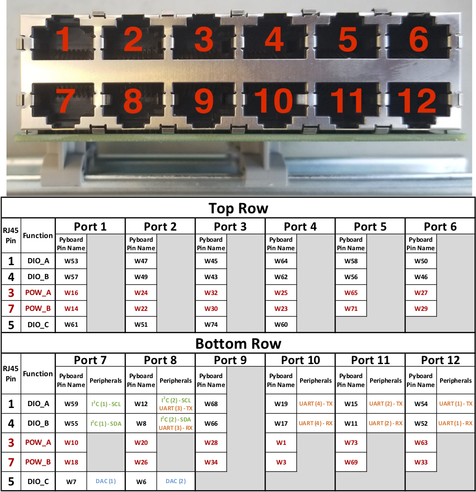

:github_url: https://github.com/Karpova-Lab/pyControl-D-Series-Breakout

=============
Build and Use
=============

Bill of Materials
=================

+-----+---------------------------------+---------------------------------------------------------------------------------------------+---------------------------------------------------------------------------------------------------------------------------------------+
| Qty | Description                     | Datasheet                                                                                   | Order Link                                                                                                                            | 
+=====+=================================+=============================================================================================+=======================================================================================================================================+
| 1   | PyControl D-Series Breakout PCB | PyControl D-Series Breakout 1.1                                                             | `OSH Park <https://oshpark.com/shared_projects/x12GQ4xq>`__                                                                           | 
+-----+---------------------------------+---------------------------------------------------------------------------------------------+---------------------------------------------------------------------------------------------------------------------------------------+
| 2   | DIN Rail Adapter                |  :download:`1201578<../../manufacturing/datasheets/DIN_clip.pdf>`                           | `Digi-Key <https://www.digikey.com/products/en?keywords=277-2296-nd>`__                                                               | 
+-----+---------------------------------+---------------------------------------------------------------------------------------------+---------------------------------------------------------------------------------------------------------------------------------------+
| 1   | Large Button                    |  :download:`B3F-4000<../../manufacturing/datasheets/tactile_switch_large.pdf>`              | `Digi-Key <https://www.digikey.com/products/en?keywords=B3F-4000>`__                                                                  | 
+-----+---------------------------------+---------------------------------------------------------------------------------------------+---------------------------------------------------------------------------------------------------------------------------------------+
| 1   | Small Button                    |  :download:`B3FS-1010P<../../manufacturing/datasheets/tactile_switch_small.pdf>`            | `Digi-Key <https://www.digikey.com/products/en?keywords=sw1440ct>`__                                                                  | 
+-----+---------------------------------+---------------------------------------------------------------------------------------------+---------------------------------------------------------------------------------------------------------------------------------------+
| 2   | 12-Port RJ45 Connector          |  :download:`5569263-1<../../manufacturing/datasheets/rj45_12port.pdf>`                      | `Digi-Key <https://www.digikey.com/products/en?keywords=5569263>`__                                                                   | 
+-----+---------------------------------+---------------------------------------------------------------------------------------------+---------------------------------------------------------------------------------------------------------------------------------------+
| 2   | 40-pin WBUS connector           |  :download:`DF40HC(4.0)-40DS-0.4V(70)<../../manufacturing/datasheets/40_pin_connector.pdf>` | `Digi-Key <https://www.digikey.com/product-detail/en/DF40HC(4.0)-40DS-0.4V(70)/H124604CT-ND/5155907/?itemSeq=290724516>`__            | 
+-----+---------------------------------+---------------------------------------------------------------------------------------------+---------------------------------------------------------------------------------------------------------------------------------------+
| 1   | 5V Linear Regulator             |  :download:`MC7805BDTRKG<../../manufacturing/datasheets/regulator.pdf>`                     | `Digi-Key <https://www.digikey.com/product-detail/en/on-semiconductor/MC7805BDTRKG/MC7805BDTRKGOSCT-ND/1139742>`__                    | 
+-----+---------------------------------+---------------------------------------------------------------------------------------------+---------------------------------------------------------------------------------------------------------------------------------------+
| 3   | Transistor Array                |  :download:`TBD62083AFNG<../../manufacturing/datasheets/transistor_array.pdf>`              | `Digi-Key <https://www.digikey.com/product-detail/en/toshiba-semiconductor-and-storage/TBD62083AFNGEL/TBD62083AFNGELCT-ND/5514123>`__ | 
+-----+---------------------------------+---------------------------------------------------------------------------------------------+---------------------------------------------------------------------------------------------------------------------------------------+
| 1   | Diode                           |  :download:`MBR120VLSFT3G<../../manufacturing/datasheets/diode.pdf>`                        | `Digi-Key <https://www.digikey.com/product-detail/en/on-semiconductor/MBR120VLSFT3G/MBR120VLSFT3GOSCT-ND/3487322>`__                  | 
+-----+---------------------------------+---------------------------------------------------------------------------------------------+---------------------------------------------------------------------------------------------------------------------------------------+
| 2   | 1µF 25V Capacitor (1206)        |                                                                                             | `Digi-Key <https://www.digikey.com/product-detail/en/C1206C105K3RACTU/399-1255-1-ND/411530/?itemSeq=290616497>`__                     | 
+-----+---------------------------------+---------------------------------------------------------------------------------------------+---------------------------------------------------------------------------------------------------------------------------------------+

CAD
===
The PCB was designed using `KiCad <http://kicad-pcb.org/>`_. 

Files can be found `here <https://github.com/Karpova-Lab/pyControl-D-Series-Breakout/tree/master/CAD>`_ 

Pinout
======
Refer to the diagram below when considering where to plug in devices.

Device file
===========
Here is a python device file that can be used within the pyControl framework. Place it in the ``devices/`` directory of your pyControl software. It can then be imported into a hardware definition file. 
   
- :download:`_breakout_dseries_1_1.py <_breakout_dseries_1_1.py>` 

.. Example Usage
.. =============
.. Here is an example hardware definition file that could be placed in the ``config/`` directory.

.. .. code:: python

..     from devices import *
..     import pyControl.hardware as _h

..     board = Breakout_D_1_1()

..     # Instantiate Devices.
..     button      = _h.Digital_input(board.button,rising_event='button',pull='up')
..     # Top Row
..     Lpoke       = TazPoke(board.port_1, nose_event = 'L_nose', lick_event = 'L_lick' )
..     Cpoke       = TazPoke(board.port_2, nose_event = 'C_nose',)
..     Rpoke       = TazPoke(board.port_3, nose_event = 'R_nose', lick_event = 'R_lick' )
..     Llever      = TazLever(board.port_4, lever_event = 'L_lever')
..     Rlever      = TazLever(board.port_5, lever_event = 'R_lever')
..     houselight  = _h.Digital_output(board.port_6.POW_A)

..     # Bottom Row
..     Lspeaker    = Audio_board(board.port_7)
..     # Rspeaker    = Audio_board(board.port_8)
..     # empty
..     # BaseStation = (board.port_10) 
..     Lpump       = TazPump(board.port_11)
..     Rpump       = TazPump(board.port_12)
