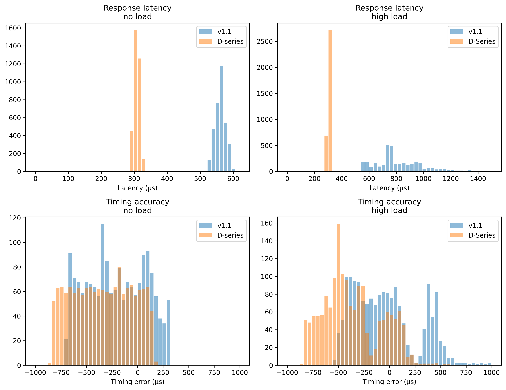

# Overview

 <!-- begin columns block -->

<--->



## What is this?

pyControl D-series breakout is a device that connects a [pyboard D-series microcontroller](https://pybd.io/hw/pybd_sfxw.html)  with twelve RJ45 ports. 
It is intended for use with the [pyControl](https://pycontrol.readthedocs.io/en/latest/) behavioral experiment control framework.

## How is it different?



The core distinction between this breakout board and the official [pyControl breakout board 1.2](https://pycontrol.readthedocs.io/en/latest/user-guide/hardware/#breakout-board-12) is the upgrade to a newer generation pyboard. 
Some benefits of the newer pyboard include being smaller, faster, having more memory, and having more input/output pins.
Having more available pins is particularly useful, as it enables the breakout board to provide more behavior ports without requiring a [port expander](https://pycontrol.readthedocs.io/en/latest/user-guide/hardware/#port-expander) Below is a comparison of the two breakout boards.

|                        | Breakout Board 1.2                                                | D-series Breakout Board 1.6                                                    |
|------------------------|-------------------------------------------------------------------|--------------------------------------------------------------------------------|
| **Microcontroller**    |                                                                   |                                                                                |
|    *Board*             | [pyboard v1.1](https://store.micropython.org/product/PYBv1.1#)    | [pyboard D-series SF6W](https://store.micropython.org/product/PYBD-SF6-W4F2)   |
|    *CPU*               | 168 MHz Cortex-M4F                                                | 216 MHz Cortex-M7F                                                             |
|    *RAM*               | 192 KB                                                            | 512 KB                                                                         |
|    *ROM*               | 512 KB                                                            | 4,048 KB                                                                       |
| **Connectors**         |                                                                   |                                                                                |
|    *RJ45*              | 6                                                                 | 12                                                                             |
|    *BNC*               | 4                                                                 | 0                                                                              |
|    *USB*               | Full Speed (12 Mbit/s)                                            | High Speed (480 Mbit/s)                                                        |
| **Behavior Ports**     |                                                                   |                                                                                |
|    *Power Driver Pins* | 14                                                                | 24                                                                             |
|    *Digital I/O Pins*  | 14                                                                | 30                                                                             |
|    *ADC Pins*          | 12                                                                | 15                                                                             |
|    *DAC Pins*          | 2                                                                 | 2                                                                              |
|    *UART Buses*        | 3                                                                 | 4                                                                              |
|    *I2C Buses*         | 2                                                                 | 2                                                                              |
| **Dimensions**         |                                                                   |                                                                                |
|    *PCB*               | 1.8 in x 7.6 in                                                   | 2.7 in x 3.6 in                                                                |
| **Performance***        |                                                                   |                                                                                |
| *Latency - No load*    | 561 ± 16 µs (100% < 1 ms)                                         | 307 ± 9 µs (100% < 1 ms)                                                       |
| *Latency - High load*  | 842 ± 293 µs (84.8% < 1 ms)                                       | 372 ± 95 µs (100% < 1 ms)                                                      |
| *Accuracy - No load*   | -210 ± 281 µs (100% < 1 ms)                                       | -342 ± 285 µs (100% < 1 ms)                                                    |
| *Accuracy - High load* | -27 ± 351 µs (99.2% < 1 ms)                                       | -361 ± 280 µs (100% < 1 ms)                                                    |

*More details about the performance comparison [here](https://github.com/Karpova-Lab/pyControl-D-Series-Breakout/tree/master/benchmarking).

