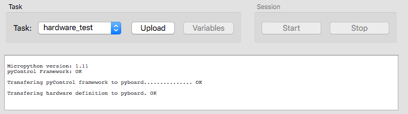

# Using

## What To Get

| Qty | Description                    | Order Link                                                           | Required |
|---|----------------------------------|----------------------------------------------------------------------|----------|
| 1 | D-series Breakout Board          | [Build your own](building.md#syringe-control-board-for-pycontrol)    | Yes      |
| 1 | pyboard D-series Microcontroller | [Micropython](https://store.micropython.org/category/pyboard%20D-series)   | Yes      |
| 1 | 12V DC Power Supply              | [Digi-Key](https://www.digikey.com/products/en?keywords=102-3631-ND) | Yes      |
| 1 | USB cable                        | [Digi-Key](https://www.digikey.com/products/en?keywords=380-1431-ND) | Yes      |
| 1 | DIN Rail                         | [Digi-Key](https://www.digikey.com/short/q8mq0f3n)                   |          |
| 2 | DIN Rail Adapter                 | [Digi-Key](https://www.digikey.com/products/en?keywords=277-2296-nd) |          |
| 4 | M3 screws                        | [Digi-Key](https://www.digikey.com/products/en?keywords=335-1156-ND) |          |


## First Time Setup

!!! warning "Important HS USB setup"

    The breakout board is designed to use the [pyboard's high speed USB interface](https://pybd.io/hw/pybd_sfxw.html#usb-ports). To ensure the correct usb mode is being used, we make a change to the ``boot.py`` file.

    1. Plug the bare pyboard D-series into your computer. 
    
    2. It should appear as a flash drive on your computer. Edit the ``boot.py`` file to have the following:
    ```python
    import pyb
    pyb.usb_mode('VCP',port=1)
    ```

    This change to ``boot.py`` is required, otherwise the pyboard won't be found by the pyControl software when it is connected through the breakout board! 

You are now ready to connect to the D-series Breakout board.

1. Plug the pyboard onto the breakout board
2. Plug 12V DC power into the breakout board
3. Connect the breakout board to your computer with the USB


## Connecting Peripheral Devices
Refer to the table below when considering where to plug in devices. Fill up the top row first with standard devices that just need inputs or outputs. Use the second row for devices that require special communication (UART or I<sup>2</sup>C).

???+ note "Note on interrupts"
    The pyboard microcontroller is limited to [16 separate interrupt vectors](https://forum.micropython.org/viewtopic.php?t=2271). 
    All of the DIO pins on the top row of the breakout board (Ports 1-6) are on separate interrupt vectors, so if you have a lot of input devices, plug them into the top row where there is a guarantee of no interrupt vector collisions.

???+ note "Note on SPI"
    If you need to connect to a peripheral using SPI, take a look at Micropython's [machine.SoftSPI](https://docs.micropython.org/en/latest/library/machine.SPI.html)

    The hardware SPI pins are unfortunately not grouped together on a single RJ45 jack on this breakout board, but instead are split up among multiple ports. 
    If you absolutely need to access the hardware SPI pins, you can plug in multiple [port adapters](https://open-ephys.org/pycontrol/pycontrol-peripherals) to expose the pins. 

    The following table desribes  hardware SPI pin mapping.

    <table style="border-collapse:collapse;border-spacing:0" class="tg"><thead><tr><th style="border-color:inherit;border-style:solid;border-width:1px;font-family:Arial, sans-serif;font-size:14px;font-weight:normal;overflow:hidden;padding:10px 5px;text-align:left;vertical-align:top;word-break:normal"> </th><th style="border-color:inherit;border-style:solid;border-width:1px;font-family:Arial, sans-serif;font-size:14px;font-weight:normal;overflow:hidden;padding:10px 5px;text-align:left;vertical-align:top;word-break:normal">SPI function</th><th style="border-color:inherit;border-style:solid;border-width:1px;font-family:Arial, sans-serif;font-size:14px;font-weight:normal;overflow:hidden;padding:10px 5px;text-align:left;vertical-align:top;word-break:normal">CPU name</th><th style="border-color:inherit;border-style:solid;border-width:1px;font-family:Arial, sans-serif;font-size:14px;font-weight:normal;overflow:hidden;padding:10px 5px;text-align:left;vertical-align:top;word-break:normal">Pin name</th><th style="border-color:inherit;border-style:solid;border-width:1px;font-family:Arial, sans-serif;font-size:14px;font-weight:normal;overflow:hidden;padding:10px 5px;text-align:left;vertical-align:top;word-break:normal">other pin name</th><th style="border-color:inherit;border-style:solid;border-width:1px;font-family:Arial, sans-serif;font-size:14px;font-weight:normal;overflow:hidden;padding:10px 5px;text-align:left;vertical-align:top;word-break:normal">D-series breakout  port</th><th style="border-color:inherit;border-style:solid;border-width:1px;font-family:Arial, sans-serif;font-size:14px;font-weight:normal;overflow:hidden;padding:10px 5px;text-align:left;vertical-align:top;word-break:normal">port function</th></tr></thead><tbody><tr><td style="border-color:inherit;border-style:solid;border-width:1px;font-family:Arial, sans-serif;font-size:14px;overflow:hidden;padding:10px 5px;text-align:left;vertical-align:top;word-break:normal" rowspan="3">SPI(1)</td><td style="border-color:inherit;border-style:solid;border-width:1px;font-family:Arial, sans-serif;font-size:14px;overflow:hidden;padding:10px 5px;text-align:center;vertical-align:top;word-break:normal">SCK</td><td style="border-color:inherit;border-style:solid;border-width:1px;font-family:Arial, sans-serif;font-size:14px;overflow:hidden;padding:10px 5px;text-align:center;vertical-align:top;word-break:normal">A5</td><td style="border-color:inherit;border-style:solid;border-width:1px;font-family:Arial, sans-serif;font-size:14px;overflow:hidden;padding:10px 5px;text-align:center;vertical-align:top;word-break:normal">x6</td><td style="border-color:inherit;border-style:solid;border-width:1px;font-family:Arial, sans-serif;font-size:14px;overflow:hidden;padding:10px 5px;text-align:center;vertical-align:top;word-break:normal">W6</td><td style="border-color:inherit;border-style:solid;border-width:1px;font-family:Arial, sans-serif;font-size:14px;overflow:hidden;padding:10px 5px;text-align:center;vertical-align:top;word-break:normal">8</td><td style="border-color:inherit;border-style:solid;border-width:1px;font-family:Arial, sans-serif;font-size:14px;overflow:hidden;padding:10px 5px;text-align:center;vertical-align:top;word-break:normal">C</td></tr><tr><td style="border-color:inherit;border-style:solid;border-width:1px;font-family:Arial, sans-serif;font-size:14px;overflow:hidden;padding:10px 5px;text-align:center;vertical-align:top;word-break:normal">MISO</td><td style="border-color:inherit;border-style:solid;border-width:1px;font-family:Arial, sans-serif;font-size:14px;overflow:hidden;padding:10px 5px;text-align:center;vertical-align:top;word-break:normal">A6</td><td style="border-color:inherit;border-style:solid;border-width:1px;font-family:Arial, sans-serif;font-size:14px;overflow:hidden;padding:10px 5px;text-align:center;vertical-align:top;word-break:normal">x7</td><td style="border-color:inherit;border-style:solid;border-width:1px;font-family:Arial, sans-serif;font-size:14px;overflow:hidden;padding:10px 5px;text-align:center;vertical-align:top;word-break:normal">W10</td><td style="border-color:inherit;border-style:solid;border-width:1px;font-family:Arial, sans-serif;font-size:14px;overflow:hidden;padding:10px 5px;text-align:center;vertical-align:top;word-break:normal">4</td><td style="border-color:inherit;border-style:solid;border-width:1px;font-family:Arial, sans-serif;font-size:14px;overflow:hidden;padding:10px 5px;text-align:center;vertical-align:top;word-break:normal">A</td></tr><tr><td style="border-color:inherit;border-style:solid;border-width:1px;font-family:Arial, sans-serif;font-size:14px;overflow:hidden;padding:10px 5px;text-align:center;vertical-align:top;word-break:normal">MOSI</td><td style="border-color:inherit;border-style:solid;border-width:1px;font-family:Arial, sans-serif;font-size:14px;overflow:hidden;padding:10px 5px;text-align:center;vertical-align:top;word-break:normal">A7</td><td style="border-color:inherit;border-style:solid;border-width:1px;font-family:Arial, sans-serif;font-size:14px;overflow:hidden;padding:10px 5px;text-align:center;vertical-align:top;word-break:normal">x8</td><td style="border-color:inherit;border-style:solid;border-width:1px;font-family:Arial, sans-serif;font-size:14px;overflow:hidden;padding:10px 5px;text-align:center;vertical-align:top;word-break:normal">W14</td><td style="border-color:inherit;border-style:solid;border-width:1px;font-family:Arial, sans-serif;font-size:14px;overflow:hidden;padding:10px 5px;text-align:center;vertical-align:top;word-break:normal">9</td><td style="border-color:inherit;border-style:solid;border-width:1px;font-family:Arial, sans-serif;font-size:14px;overflow:hidden;padding:10px 5px;text-align:center;vertical-align:top;word-break:normal">B</td></tr><tr><td style="border-color:inherit;border-style:solid;border-width:1px;font-family:Arial, sans-serif;font-size:14px;overflow:hidden;padding:10px 5px;text-align:left;vertical-align:top;word-break:normal" rowspan="3">SPI(2)</td><td style="border-color:inherit;border-style:solid;border-width:1px;font-family:Arial, sans-serif;font-size:14px;overflow:hidden;padding:10px 5px;text-align:center;vertical-align:top;word-break:normal">SCK</td><td style="border-color:inherit;border-style:solid;border-width:1px;font-family:Arial, sans-serif;font-size:14px;overflow:hidden;padding:10px 5px;text-align:center;vertical-align:top;word-break:normal">B13</td><td style="border-color:inherit;border-style:solid;border-width:1px;font-family:Arial, sans-serif;font-size:14px;overflow:hidden;padding:10px 5px;text-align:center;vertical-align:top;word-break:normal">y6</td><td style="border-color:inherit;border-style:solid;border-width:1px;font-family:Arial, sans-serif;font-size:14px;overflow:hidden;padding:10px 5px;text-align:center;vertical-align:top;word-break:normal">W49</td><td style="border-color:inherit;border-style:solid;border-width:1px;font-family:Arial, sans-serif;font-size:14px;overflow:hidden;padding:10px 5px;text-align:center;vertical-align:top;word-break:normal">2</td><td style="border-color:inherit;border-style:solid;border-width:1px;font-family:Arial, sans-serif;font-size:14px;overflow:hidden;padding:10px 5px;text-align:center;vertical-align:top;word-break:normal">C</td></tr><tr><td style="border-color:inherit;border-style:solid;border-width:1px;font-family:Arial, sans-serif;font-size:14px;overflow:hidden;padding:10px 5px;text-align:center;vertical-align:top;word-break:normal">MISO</td><td style="border-color:inherit;border-style:solid;border-width:1px;font-family:Arial, sans-serif;font-size:14px;overflow:hidden;padding:10px 5px;text-align:center;vertical-align:top;word-break:normal">C2</td><td style="border-color:inherit;border-style:solid;border-width:1px;font-family:Arial, sans-serif;font-size:14px;overflow:hidden;padding:10px 5px;text-align:center;vertical-align:top;word-break:normal">y7</td><td style="border-color:inherit;border-style:solid;border-width:1px;font-family:Arial, sans-serif;font-size:14px;overflow:hidden;padding:10px 5px;text-align:center;vertical-align:top;word-break:normal">W53</td><td style="border-color:inherit;border-style:solid;border-width:1px;font-family:Arial, sans-serif;font-size:14px;overflow:hidden;padding:10px 5px;text-align:center;vertical-align:top;word-break:normal">1</td><td style="border-color:inherit;border-style:solid;border-width:1px;font-family:Arial, sans-serif;font-size:14px;overflow:hidden;padding:10px 5px;text-align:center;vertical-align:top;word-break:normal">A</td></tr><tr><td style="border-color:inherit;border-style:solid;border-width:1px;font-family:Arial, sans-serif;font-size:14px;overflow:hidden;padding:10px 5px;text-align:center;vertical-align:top;word-break:normal">MOSI</td><td style="border-color:inherit;border-style:solid;border-width:1px;font-family:Arial, sans-serif;font-size:14px;overflow:hidden;padding:10px 5px;text-align:center;vertical-align:top;word-break:normal">C3</td><td style="border-color:inherit;border-style:solid;border-width:1px;font-family:Arial, sans-serif;font-size:14px;overflow:hidden;padding:10px 5px;text-align:center;vertical-align:top;word-break:normal">y8</td><td style="border-color:inherit;border-style:solid;border-width:1px;font-family:Arial, sans-serif;font-size:14px;overflow:hidden;padding:10px 5px;text-align:center;vertical-align:top;word-break:normal">W57</td><td style="border-color:inherit;border-style:solid;border-width:1px;font-family:Arial, sans-serif;font-size:14px;overflow:hidden;padding:10px 5px;text-align:center;vertical-align:top;word-break:normal">1</td><td style="border-color:inherit;border-style:solid;border-width:1px;font-family:Arial, sans-serif;font-size:14px;overflow:hidden;padding:10px 5px;text-align:center;vertical-align:top;word-break:normal">B</td></tr></tbody></table>
    [https://store.micropython.org/media/products/PYBD_SF2_W4F2_ds2.jpg](https://store.micropython.org/media/products/PYBD_SF2_W4F2_ds2.jpg)
    [https://store.micropython.org/media/products/WBUS_DIP68_ds1.jpg](https://store.micropython.org/media/products/WBUS_DIP68_ds1.jpg)

<a href="pinouts.jpg">
    
    </img>
</a>
<a href="board_front_labeled.jpg">
    
    </img>
</a>

## Example Task
The following instructions will enable you to run the ``hardware_test.py`` task file that comes with pyControl. The task uses 3 nosepokes plugged into ports 1-3 and a houselight plugged into port 4.

1. Download the latest version of [pyControl](https://github.com/pyControl/code/releases)
2. Download <a href="breakout_dseries_1_6.py" download >:material-file-download: breakout_dseries_1_6.py</a> and place it in the ``devices\`` directory
3. Download <a href="new_hardware_definition.py" download >:material-file-download: new_hardware_definition.py</a> and place it in the ``config\`` directory 
```
.
└─ pyControl
   ├ config
   │  └─ new_hardware_definition.py
   └─ devices
      └─ breakout_dseries_1_6.py
```
4. Launch pyControl and press the "Connect" button to connect to the breakout board.
5. Press the "Config" button and the "Load framework" button. 
6. Again, press the "Config" button. Press the "Load hardware definition" button and then select "new_hardware_definition.py" to upload.
7. If successful, you should get a couple OK's confirming that the framework and hardware definition have been transferred.

8. From the task dropdown, select "examples/hardware_test", then click "Upload".
9. Click "Start". The houselight should turn on and nosepokes will now respond to pokes.

