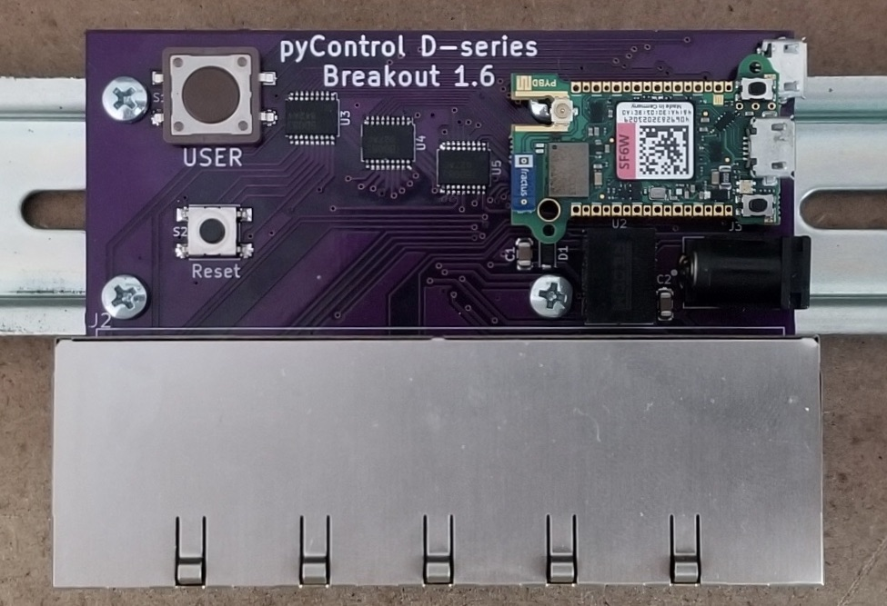
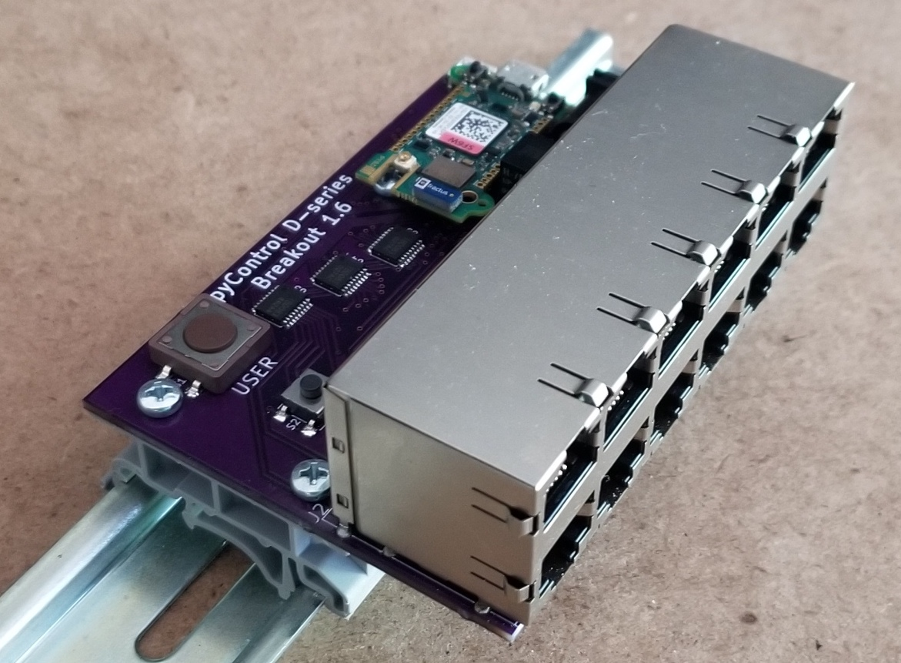

- View documentation at  https://karpova-lab.github.io/pyControl-D-Series-Breakout/
- Ask questions at https://github.com/Karpova-Lab/pyControl-D-series-Breakout/discussions
- Clone repository from https://github.com/Karpova-Lab/pyControl-D-Series-Breakout

## License
This project is licensed under the [Janelia open-source hardware license](license_hardare.txt) and [Janelia 3-term BSD open-source software license](license_software.txt).

Please contact [innovation@janelia.hhmi.org](mailto:innovation@janelia.hhmi.org) if you have any questions about licensing or would like to use this project commercially.